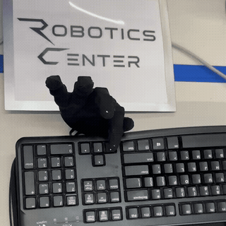
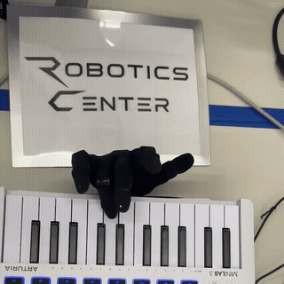
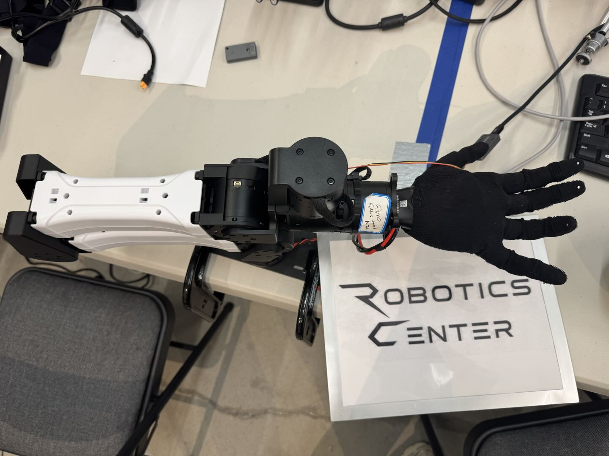

<p align="center">
  
</p>

# RC DexBench

<p align="center">
  <a href="https://github.com/RoboticsCenter/dexbench/actions/workflows/lint.yml"></a>
  <a href="https://github.com/RoboticsCenter/dexbench/actions/workflows/lint.yml"></a>
  
  
  <a href="LICENSE"></a>
</p>

RC DexBench is an open benchmark and evaluation toolkit for dexterous robotic hands. It defines tasks, hardware and session metadata, event-based scoring, and a common adapter interface so teams can compare teleoperation, replay, and learned policies with the same protocol.

DexBench measures finger-level contact and force control, plus fixed-scene arm-and-hand pick-and-place. The benchmark records MIDI velocity, keyboard events, tactile measurements, command-to-contact latency, and clock alignment.

## Tasks

| Task | Goal | Trials per policy | Setup | Automatic outcome |
| --- | --- | ---: | --- | --- |
| `keypress-ldr` | Index, middle, ring press LEFT → DOWN → RIGHT | 20 | [Rig setup](hardware/keypress-ldr.md) | Dedicated USB keyboard events |
| `piano-seq` | Play MIDI notes 60 → 62 → 64 with even, medium force | 20 | [Rig setup](hardware/piano-seq.md) | MIDI note, timestamp, and velocity events |
| `pick-place-ab` | Move a tennis ball, 3×3 cube, or capped whiteboard marker from zone A into a tray | 10 per object (30 total) | [Rig setup](hardware/pick-place-ab.md) | Tray region, hand release, and stability signals |

Task protocols and measurable outcomes are in [SPEC.md](SPEC.md). See [recordings and scoring](docs/recordings-and-scoring.md) for benchmark result files and clock alignment.

## Task clips and rig photo

Each square GIF shows its matching task. The photo shows the robot hand and arm rig.

### `keypress-ldr`



### `piano-seq`



### `pick-place-ab`



## Quick start

Install from a fresh checkout with Python 3.10 or later:

```bash
git clone https://github.com/RoboticsCenter/dexbench.git
cd dexbench
python -m venv .venv
source .venv/bin/activate
python -m pip install -e .
dexbench tasks
```

Run the bundled pipeline example and inspect its per-trial MCAP and JSON summary:

```bash
dexbench run --task keypress-ldr --policy scripted --adapter mock --trials 2
dexbench score --task keypress-ldr --mcap runs/<run-id>/trial-001.mcap
```

The scripted policy and mock adapter generate synthetic events to demonstrate the recording and scoring workflow.

Real-robot runs use an adapter for the hand, sensors, and arm in the configured rig. See [Connect a hand or rig](docs/add_an_adapter.md) for the adapter interface.

## LLM example policy

The built-in GPT-6 Astra policy is an example for `keypress-ldr`. It uses the OpenAI Chat Completions API and returns one bounded `press` action at a time for `index`, `middle`, or `ring`; the adapter maps that action to the robot's configured finger motion. Use a [custom policy factory](docs/add_an_adapter.md#add-a-task-policy) for `piano-seq`, `pick-place-ab`, or another policy. See the [GPT-6 Astra API documentation](https://developers.openai.com/api/docs/models/gpt-6-astra).

```bash
export DEXBENCH_LLM_BASE_URL="https://api.openai.com/v1"
export OPENAI_API_KEY="<your-api-key>"
export DEXBENCH_LLM_MODEL="gpt-6-astra"
export DEXBENCH_LLM_REASONING_EFFORT="low"
dexbench run --task keypress-ldr --policy llm --adapter mock --trials 1
```

The request and response are recorded on `/dexbench/policy_trace`; credentials are omitted. The policy accepts only the listed finger actions or `stop`. Replace `mock` with your robot adapter to connect the policy to a hand. See [the adapter guide](docs/add_an_adapter.md).

## Teleop and replay baselines

A robot adapter can expose `teleop_action(observation)` to collect an operator baseline. The replay policy reads the command stream from one successful teleop trial and preserves its original relative timing. To select the successful teleop trial closest to the median completion time and replay it on the same rig:

```bash
dexbench run --task keypress-ldr --policy teleop \
  --adapter my_robot.dexbench_adapter:create_adapter --trials 20 \
  --calib-id session-2026-09-27-a --session-metadata session.json

dexbench run --task keypress-ldr --policy replay \
  --adapter my_robot.dexbench_adapter:create_adapter --trials 20 \
  --calib-id session-2026-09-27-a --session-metadata session.json \
  --replay-results runs/<teleop-run-id>/results.json
```

The replay command checks the task, calibration ID, and hardware metadata against the teleop run. For piano-seq, it selects a successful teleop episode with median completion time, just as it does for the other tasks.

## Results

Publish each run's task, policy and model, success rate, completion time, hardware and calibration metadata, and links to its `results.json` and MCAP trial recordings. Include failed trials and give a reason for each invalid hardware trial. Upload and view recorded MCAP data at [DexData](https://dexdata.roboticscenter.ai); view published benchmark results at [Dexterity Benchmark Results](https://dexterity.roboticscenter.ai/benchmark). See [results publishing](results/README.md).

| Recorded example | Label in source run | MCAP |
| --- | --- | --- |
| Episode 4 | Success | [View recording](examples/keypress-ldr/episode_4_success.mcap) |
| Episode 5 | Failure | [View recording](examples/keypress-ldr/episode_5_failure.mcap) |

These recordings are examples, not DexBench-scored results or a complete benchmark round. The source GUI logger may report repeated key events while a key is held; see the [example notes](examples/keypress-ldr/) and the key-repeat event contract in [SPEC.md](SPEC.md#event-format).

## Baselines and protocol

Each policy run writes one JSON summary and one MCAP per trial. Benchmark runs keep failures. The reference baselines are:

- **Teleop:** a human operator using the same robot and task setup. Its run can be generated by a hardware adapter that maps the operator's controls into DexBench actions.
- **Replay:** open-loop playback of the `/hand/command` stream, plus `/arm/command` for pick-and-place, from the successful teleop episode with the median completion time. Keep hardware and calibration fixed between source and replay runs.
- **Learned policy:** report the model, weights, endpoint/provider, prompt or policy version, action limits, and all run settings.

Replay and operator control are adapter-level capabilities because command units depend on the robot. The result format and scoring are shared. See the [interface specification](SPEC.md).

For piano-seq, report each note's MIDI velocity, within-trial velocity standard deviation, the mean and standard deviation across trials for each assigned finger, the fraction of notes with velocity 50–90, and tactile-to-velocity correlation when tactile data is available. Velocity is a reported measure and does not affect task success.

## Add a hand or task

- [Connect a hand or rig](docs/add_an_adapter.md)
- [Add a task](docs/write_a_task.md)
- [Recordings and scoring](docs/recordings-and-scoring.md)
- [Hardware reference sheets](hardware/)

The command-line workflow is native to DexBench. Its packaging and benchmark workflow take inspiration from [Inspect Robots](https://github.com/robocurve/inspect-robots), [WorldEvals](https://github.com/robocurve/worldevals), and [StationeryBench](https://github.com/robocurve/stationerybench), while remaining independent so tactile and contact-event channels are part of its own event and scoring contract.

## License and citation

Released under the Apache License 2.0. See [LICENSE](LICENSE).

```bibtex
@software{rc_dexbench,
  author = {{Robotics Center}},
  title = {RC DexBench: An Open Benchmark for Dexterous Robot Evaluation},
  year = {2026},
  url = {https://github.com/RoboticsCenter/dexbench},
  version = {0.1.0},
  license = {Apache-2.0}
}
```
